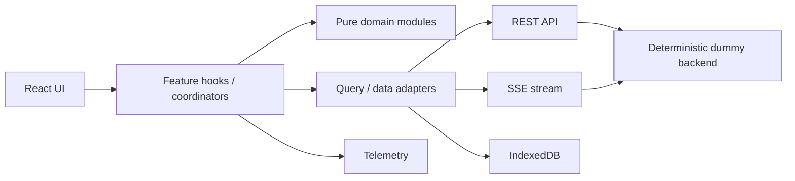

# Clinical Note Review

## Project Overview

A production-shaped React take-home for clinical-note generation, review, immutable versioning, offline work, and safe reconciliation.

## Tech Stack

React 19, TypeScript strict mode, Vite, React Router, TanStack Query/Virtual, Zustand, Dexie, Vitest, React Testing Library, and Playwright.

## Running Locally

```sh
npm install
npm run dev
```

The Vite dummy API seeds 5,000 deterministic notes. `POST /api/dev/seed` accepts `{ "count": 100000 }` for scale exercises.

## Testing

```sh
npm run typecheck
npm run lint
npm test
npm run test:stress
npm run build
npm run test:e2e
```

Install Chromium for E2E when needed: `npx playwright install chromium`.

## Architecture



Dependencies are one-way: feature/UI code depends on application/data/domain contracts; domain has no React or browser imports; the backend independently validates workflow policy.

## Domain Model

`Note` is the workflow container. SOAP text is immutable `NoteVersion` data linked by `parentVersionId`. `ReviewEvent` is append-only audit history.

## Architecture Overview

`domain/` contains framework-independent types, permissions, version-graph helpers, diffing, and the lifecycle state machine. `data/` owns REST/SSE/IndexedDB adapters and TanStack Query integration. `features/` owns view composition and use-case coordinators; React components do not determine workflow permissions by checking statuses. `auth/` supplies the session-scoped mock actor. `telemetry/` is the sole telemetry boundary. The Vite-only `backend/` is a deterministic local API and validates the same policy independently.

## State Ownership

Server-authoritative state is the note workflow status, assignment, current version ID, immutable versions, and ReviewEvents. TanStack Query caches that state. URL parameters own Notes List filters, search, and sort. Feature state owns the active SOAP draft, section dirtiness, selected versions, and conflict presentation. Zustand holds only the current mock session UI state. Dexie durably stores snapshots, working drafts, queued mutations, and telemetry retry batches.

## State Machine

`src/domain/state-machine.ts` centralizes transition sources, guards, effects, and deterministic failures. UI actions use domain selectors and the backend invokes the same model.

## Optimistic Updates

Transitions are validated before REST calls, stage temporary audit events, and reconcile to server event IDs. Errors remove the temporary event and restore displayed state.

## Autosave

`SaveCoordinator` debounces dirty drafts, permits only one write per note, coalesces in-flight edits, and reuses failed mutation IDs on retry. The online lifecycle is: edit → dirty section → debounce → coordinator → `baseVersionId` + `clientMutationId` → immutable server version → HTTP/SSE reconciliation → acknowledged server truth. Changes while a write is active produce exactly one follow-up write containing the latest draft.

## Versioning

Writes carry `baseVersionId` and `clientMutationId`. The backend preserves immutable versions and returns `409 version_conflict` instead of overwriting a stale head.

## Concurrency

Conflicts preserve local work and target the current server head for a new write. The Playwright suite exercises two independent reviewer sessions editing the same base version.

## Three-Way Conflict Resolution

For local base V1, remote head V2, and a local draft, a stale save receives `409 version_conflict`. The reusable conflict abstraction presents base/current/local values and supports local/server/manual continuation; the resolved draft is saved as V3 against V2. It never silently overwrites or reloads the page. The same path is used for online, offline replay, and real-time supersession conflicts.

## Offline Architecture

Dexie persists command ID, note, operation, payload, base version, timestamps, retry metadata, dependencies, and working drafts. Ordered replay blocks later per-note commands on a conflict. The persistent status indicator distinguishes server save from local queueing.

Current limitation: queueing is triggered by browser connectivity (`navigator.onLine`). An API-only outage while the browser remains online is not independently classified as backend-offline, and browser-level outage → reload → reconnect proof is deferred.

## Real-Time Reconciliation

The SSE mock supports stable IDs, persisted cursor replay, reconnect backoff/jitter, and duplicate/out-of-order tolerance. Subscriptions are reference-counted and scoped to visible virtual rows or the open detail note. QueryClient reconciliation covers event-before-HTTP acknowledgement, duplicate version events, stale status events, and own-save events. A deterministic client reconnect test validates resubscription from the last cursor; full browser reconnect/replay proof remains deferred.

Presence joins/leaves are session-scoped, deduplicated per note, exclude the current viewer in the UI, and never affect workflow permissions.

## Authorization Model

Capability helpers are UX-only. Backend validation remains authoritative for roles, assignment, MFA, and legal state transitions.

## Telemetry

`TelemetryClient.track(name, properties, options)` is the only client-side telemetry entry point. Events have stable IDs, are batched at 20 events or every 10 seconds, and preserve enqueue order. Route changes flush prior pending work; hidden/pagehide lifecycle events use `sendBeacon` when available, then `fetch(..., { keepalive: true })`.

Failed batches retry with exponential backoff (500 ms base, capped at 30 seconds). After three failed attempts they are parked in Dexie and restored/delivered on the next client initialization. Telemetry is deliberately best-effort: no note save, transition, or realtime flow awaits telemetry delivery.

## PII Redaction Exemption

PII redaction is exempt for this submission. `sanitizeTelemetry()` is the intentional insertion boundary for production redaction, allowlisting, and schema enforcement.

## Performance and Scale

The list uses 50-record cursor pages and virtualized rendering; there is no all-record API. Query abort signals cancel stale fetches, event subscriptions/timers clean up, and deterministic seeds support 100k logical records without creating 100k DOM rows. The 500-note stress suite verifies realtime subscription/listener cleanup. The current main chunk exceeds Vite's 500 kB advisory threshold; route-level splitting of the detail/diff feature is a reasonable future optimization.

## Accessibility / WCAG 2.2 AA

Designed and tested toward WCAG 2.2 AA requirements: semantic grids/forms/lists, visible focus, labeled inputs, keyboard row navigation, live connectivity/status announcements, disabled-action descriptions, and accessible version/timeline structures are implemented. Reject confirmation is a keyboard-managed dialog that restores trigger focus on Escape; conflicts are named, focusable resolution regions. LOCKED notes use disabled SOAP controls and an explicit read-only notice. UI permissions are explanatory only—the backend remains authoritative, with browser coverage for an unassigned reviewer and direct mutation rejection.

## Testing Strategy

Vitest covers the state machine, version graph, backend pagination/idempotency/conflicts, dirty tracking, diff, autosave races, optimistic/QueryClient reconciliation, offline queue replay, real-time dedupe/order, telemetry, and URL state. Playwright covers smoke behavior, concurrent reviewers, keyboard/focus accessibility, locked notes, and layered authorization. Stress coverage validates 500-note presence/subscription lifecycle cleanup.

## Deterministic Demo Data and Identities

The Vite mock resets to deterministic seed data through `POST /api/dev/seed`. Browser test sessions select a mock actor by writing `clinical-note-mock-current-user` to session storage before the application loads. Reviewer identities are therefore independent per browser context; production identity is expected from a server session/token.

## Failure Scenarios

Automated coverage includes stale writes, retry idempotency, offline queue persistence/replay, duplicate and stale real-time events, event-before-ack reconciliation, two-reviewer conflict resolution, telemetry failure, locked mutation rejection, and authorization denial. Browser API-outage/reload/reconnect remains deferred.

## Assumptions

The dummy backend uses a demo actor; production identity, MFA proof, event durability, and authorization must be supplied by real services.

## Trade-offs

SSE fits the server-to-client mock channel. Offline saves coalesce to the newest draft before replay. The in-memory backend favors deterministic tests over durability.

## Known Limitations

The mock backend is intentionally local and in-memory. API-only outage detection beyond `navigator.onLine` and a browser-level offline reload/reconnect proof are deferred. PII telemetry sanitization is exempt for this iteration; `sanitizeTelemetry()` is its insertion boundary. No service worker/PWA cache layer is included. The current production bundle is 534.50 kB raw (169.41 kB gzip) and emits Vite's advisory warning; route-level splitting is deferred to avoid destabilizing the take-home. Test-only realtime injection/acknowledgement controls are not exposed as HTTP endpoints and are inert unless a test imports and activates them.
