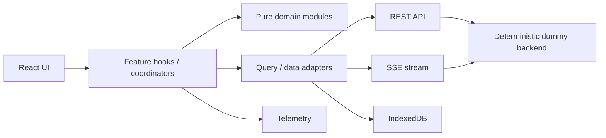

# Clinical Note Review

## Project Overview

A production-shaped React take-home for clinical-note generation, review, immutable versioning, offline work, and safe reconciliation.

## Tech Stack

React 19, TypeScript strict mode, Vite, React Router, TanStack Query/Virtual, Zustand, Dexie, Vitest, React Testing Library, and Playwright.

## Running Locally

```sh
npm install
npm run dev
```

The Vite dummy API seeds 5,000 deterministic notes. `POST /api/dev/seed` accepts `{ "count": 100000 }` for scale exercises.

## Testing

```sh
npm run typecheck
npm run lint
npm test
npm run build
npm run test:e2e
```

Install Chromium for E2E when needed: `npx playwright install chromium`.

## Architecture



Dependencies are one-way: feature/UI code depends on application/data/domain contracts; domain has no React or browser imports; the backend independently validates workflow policy.

## Domain Model

`Note` is the workflow container. SOAP text is immutable `NoteVersion` data linked by `parentVersionId`. `ReviewEvent` is append-only audit history.

## State Topology

TanStack Query owns remote data; URL parameters own Notes List filters/sort/search; the feature owns working editor drafts; Dexie owns snapshots, durable writes, and telemetry batches; Zustand holds only small session UI state.

## State Machine

`src/domain/state-machine.ts` centralizes transition sources, guards, effects, and deterministic failures. UI actions use domain selectors and the backend invokes the same model.

## Optimistic Updates

Transitions are validated before REST calls, stage temporary audit events, and reconcile to server event IDs. Errors remove the temporary event and restore displayed state.

## Autosave

`SaveCoordinator` debounces dirty drafts, permits only one write per note, coalesces in-flight edits, and reuses failed mutation IDs on retry.

## Versioning

Writes carry `baseVersionId` and `clientMutationId`. The backend preserves immutable versions and returns `409 version_conflict` instead of overwriting a stale head.

## Concurrency

Conflicts preserve local work and target the current server head for a new write.

## Three-Way Conflict Resolution

The reusable conflict abstraction presents common ancestor, server head, and local draft, then supports local/server/manual continuation. The same path is used for online, offline replay, and real-time supersession conflicts.

## Offline Architecture

Dexie persists command ID, note, operation, payload, base version, timestamps, retry metadata, and dependencies. Ordered replay blocks later per-note commands on a conflict. The persistent status indicator distinguishes server save from local queueing.

## Real-Time Reconciliation

The SSE mock supports cursor replay, stable IDs, duplicate/out-of-order tolerance, reconnect backoff/jitter, and persisted cursor. Subscriptions are reference-counted and scoped to visible virtual rows or the open detail note.

## Authorization Model

Capability helpers are UX-only. Backend validation remains authoritative for roles, assignment, MFA, and legal state transitions.

## Telemetry

`TelemetryClient.track(name, properties, options)` is the only client-side telemetry entry point. Events have stable IDs, are batched at 20 events or every 10 seconds, and preserve enqueue order. Route changes flush prior pending work; hidden/pagehide lifecycle events use `sendBeacon` when available, then `fetch(..., { keepalive: true })`.

Failed batches retry with exponential backoff (500 ms base, capped at 30 seconds). After three failed attempts they are parked in Dexie and restored/delivered on the next client initialization. Telemetry is deliberately best-effort: no note save, transition, or realtime flow awaits telemetry delivery.

## PII Redaction Exemption

PII redaction is exempt for this submission. `sanitizeTelemetry()` is the intentional insertion boundary for production redaction, allowlisting, and schema enforcement.

## Performance and Scale

The list uses 50-record cursor pages and virtualized rendering; there is no all-record API. Query abort signals cancel stale fetches, event subscriptions/timers clean up, and the seed supports 100k records. The current bundle exceeds Vite's 500 kB advisory threshold and should be route-split before production.

## Accessibility / WCAG 2.2 AA

Designed and tested toward WCAG 2.2 AA requirements: semantic grids/forms/lists, visible focus, labeled inputs, keyboard row navigation, live connectivity/status announcements, disabled-action descriptions, and accessible version/timeline structures are implemented. Reject confirmation is a keyboard-managed dialog that restores trigger focus on Escape; conflicts are named, focusable resolution regions. LOCKED notes use disabled SOAP controls and an explicit read-only notice. UI permissions are explanatory only—the backend remains authoritative, with browser coverage for an unassigned reviewer and direct mutation rejection.

## Testing Strategy

Vitest covers state machine, version graph, backend pagination/idempotency/conflicts, dirty tracking, diff, autosave races, optimistic reconciliation, offline queue replay, real-time dedupe/order, telemetry, and URL state. Playwright supplies a smoke flow for list/search/detail/review/edit/history/reject.

## Failure Scenarios

Automated coverage includes stale writes, retry idempotency, offline replay, duplicate real-time events, and out-of-order statuses. Manual follow-up scenarios: two-reviewer conflict, mid-save reload, SSE-before-REST acknowledgement, admin supersession before resubmit, and navigation across 500 notes with listener inspection.

## Assumptions

The dummy backend uses a demo actor; production identity, MFA proof, event durability, and authorization must be supplied by real services.

## Trade-offs

SSE fits the server-to-client mock channel. Offline saves coalesce to the newest draft before replay. The in-memory backend favors deterministic tests over durability.

## Known Limitations

Presence is modeled by the protocol but the dummy backend does not yet simulate named viewers. Offline cached reads cover detail snapshots, not list-query hydration. E2E is a smoke suite, not a complete cross-browser audit.
