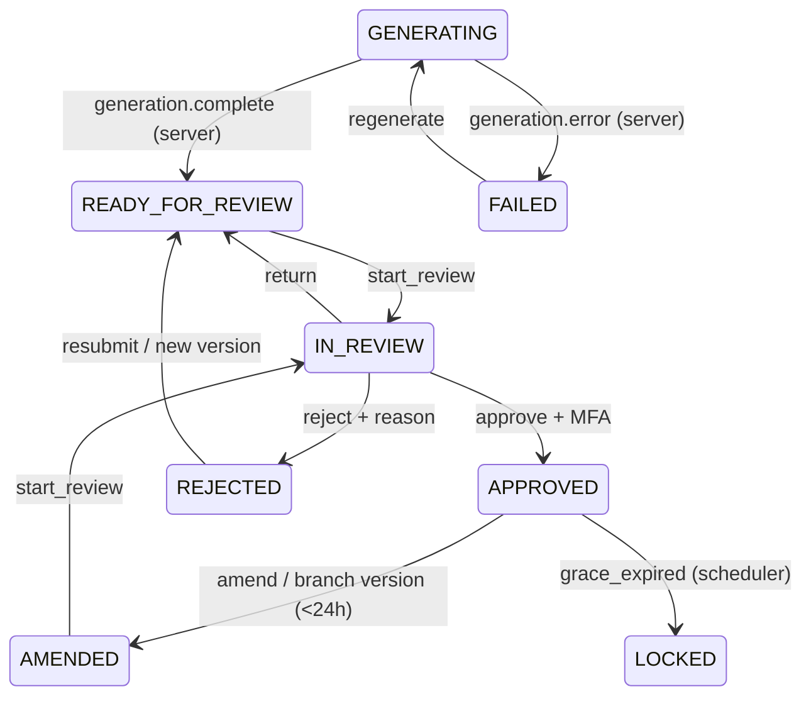

# Note lifecycle state machine

`evaluateTransition(context, action)` is the only client-side source for lifecycle decisions. It is pure: the caller applies its returned effects only after the server accepts the command.

The centralized `transitionSpecifications` map owns sources, allowed predecessor states, roles, guards, target state, and declarative effects. The data layer should use the same action and context when submitting server commands; a server decision always remains authoritative.

Approval requires `mfaReauthenticated: true`. On success, the explicit `RECORD_MFA_REAUTHENTICATION` effect is returned for audit persistence; otherwise the machine returns `MFA_REAUTH_REQUIRED` without changing state.
